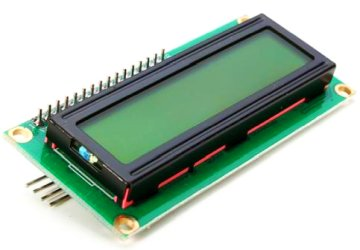
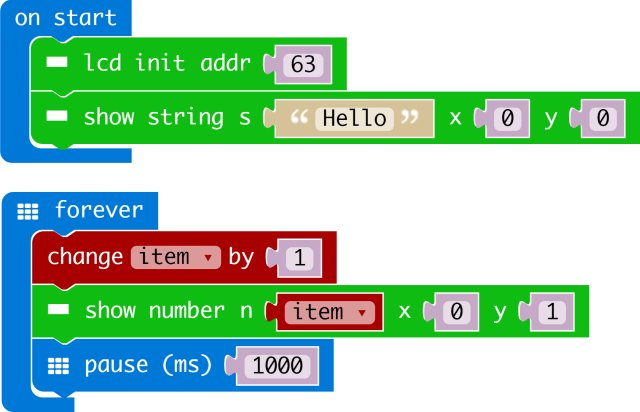

# LCD1802

makecode LCD1802 I2C package for micro:bit  

Author: adambla76  
Date:   2019.Oct  
  


## Add extension

open your microbit makecode project, in Extension, paste  

https://github.com/makecode-packages/i2cLCD1602  

to search box then search.

## Basic usage

```
let item = 0
LCD1802.LcdInit(0)
LCD1802.ShowString("Hello", 0, 0)
basic.forever(() => {
    item += 1
    LCD1802.ShowNumber(item, 0, 1)
    basic.pause(1000)
})
```


## I2C Address  
- JHD1802: 3E  
- Auto: 0

## API

- LcdInit(Addr: number)  
Initial LCD  
Addr: I2C Address. If Addr is zero, it will try to recognition correctly address automaticly.  

- ShowNumber(n: number, x: number, y: number)  
show a number in LCD at given position.  
n: number will be show  
x: is LCD column position, [0 - 15]  
y: is LCD row position, [0 - 1]  

- ShowString(s: string, x: number, y: number)  
show a string in LCD at given position.  
s: string will be show  
x: is LCD column position, [0 - 15]  
y: is LCD row position, [0 - 1]  

- on()  
turn on LCD  

- off()  
turn off LCD  

- clear()  
clear LCD content  

- BacklightOn()  
turn on LCD backlight  

- BacklightOff()  
turn off LCD backlight  

- shl()
shift left screen

- shr()
shift right screen


## Demo



## License

MIT

Copyright (c) 2018, microbit/micropython Chinese community  

## Supported targets

* for PXT/microbit


[From microbit/micropython Chinese community](http://www.micropython.org.cn)
